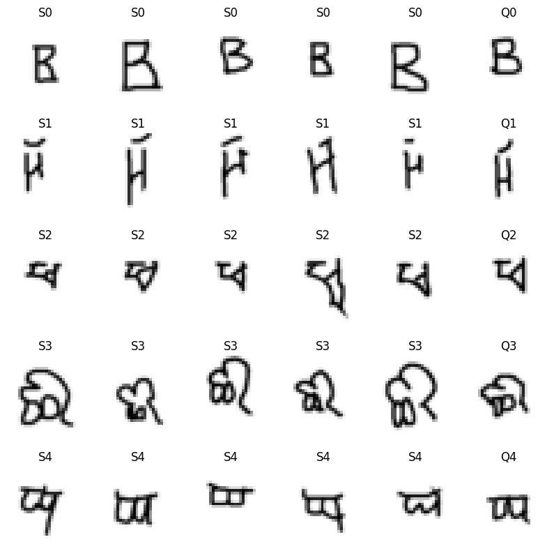

<!DOCTYPE html>
<html lang="en">
<head>
  <meta charset="UTF-8">
  <title>Few-shot Learning with Prototypical Networks</title>
  
</head>

<body>

<h1>🚀 Few-shot Learning with Prototypical Networks (ProtoNet)</h1>

This project implements <b>Prototypical Networks (ProtoNet)</b>, a powerful method for 
<b>few-shot learning</b>, where a model can classify data using only a few examples per class.

Test Accuracy: ~97.46% 🔥

<h2>🧠 Key Idea</h2>

<ul>
  <li>Learn a meaningful <b>embedding space</b></li>
  <li>Compute a <b>prototype (mean vector)</b> for each class</li>
  <li>Classify by selecting the <b>nearest prototype</b></li>
</ul>

<b>Pipeline:</b>

<pre>
Support set → compute prototypes  
Query → compare distances → predict class
</pre>

Instead of learning a fixed classifier, ProtoNet learns how to compare samples in an embedding space.

<h2>📦 Dataset</h2>

<ul>
  <li><b>Dataset:</b> Omniglot</li>
  <li>1623 character classes</li>
  <li>20 samples per class</li>
</ul>

Omniglot is widely used for few-shot learning because it contains many classes with very few samples.

<h2>🏗️ Model Architecture</h2>

<ul>
  <li>4-layer CNN encoder</li>
  <li>Each block: Conv → BatchNorm → ReLU → MaxPool</li>
  <li>Output: embedding vector</li>
</ul>

The network learns to map images into a space where samples from the same class cluster together.

<h2>🔁 Training Strategy</h2>

<ul>
  <li>Training is done in <b>episodes</b></li>
  <li>Each episode simulates a <b>N-way K-shot task</b></li>
</ul>

<pre>
Example: 5-way 5-shot
→ 5 classes, 5 samples per class
</pre>

<b>Training Progress:</b>

<pre>
Episode 0   → Accuracy: 0.93  
Episode 200 → Accuracy: 1.00  
Episode 800 → Accuracy: 1.00  
</pre>

The model converges quickly and achieves near-perfect training accuracy.

<h2>🧪 Evaluation</h2>

<pre>
Test Accuracy: 0.9746 (~97.46%)
</pre>

<b>Comparison with benchmark:</b>

<ul>
  <li>ProtoNet paper: ~99.7%</li>
  <li>This implementation: ~97.46%</li>
</ul>

This is a strong result for a simple implementation without heavy tuning.

<h2>🖼️ Episode Visualization</h2>

Each row represents a class:

<ul>
  <li><b>S0 → S4:</b> Support samples</li>
  <li><b>Q:</b> Query sample</li>
</ul>

<b>How it works:</b>

<ul>
  <li>Compute prototype from support samples</li>
  <li>Compare query embedding to all prototypes</li>
  <li>Select nearest class</li>
</ul>

<b>Observation:</b>

<ul>
  <li>Query samples visually match their support set</li>
  <li>Classes are clearly separated</li>
</ul>

This demonstrates that the model has learned a meaningful embedding space.

<h2>📌 Results Analysis</h2>

<ul>
  <li>✅ High accuracy (~97%)</li>
  <li>✅ Fast convergence</li>
  <li>✅ Clear class separation in embedding space</li>
  <li>⚠️ Slight gap compared to paper (~99%)</li>
</ul>

<h2>🚀 Future Improvements</h2>

<ul>
  <li>Normalize embeddings (L2 normalization)</li>
  <li>Use deeper backbone (ResNet)</li>
  <li>Train with higher N-way tasks (e.g., 20-way)</li>
  <li>Apply to more complex datasets (miniImageNet)</li>
</ul>

<h2>🎯 Conclusion</h2>

✔ Successfully implemented Prototypical Networks from scratch  

✔ Learned a robust embedding space for few-shot classification  

🔥 Achieved strong performance close to state-of-the-art  

</body>
</html>